# What is this project?

An opensouce voice assistant that can perform various tasks like setting reminders, searching the web, getting weather, etc. It is built using Python and uses the Vosk library for voice recognition and the pyttsx3 library for text-to-speech conversion.

## Features

- Voice recognition
- Text-to-speech conversion
- Web search
- Reminder system
- Todo list
- Weather updates
- Jokes
- Math operations (__Coming soon__)
- News updates

## How to use

1. Clone the repository
2. Install the required libraries using `pip install -r requirements.txt`
3. Install the Vosk model from [here](https://alphacephei.com/vosk/models)
4. Extract the model and place it in the `models` folder
5. Create a .env file (e.g. example.env) in the root directory and add the following variables:
    - `WEATHER_API_KEY` - API key for the OpenWeatherMap API
    - `NEWS_API_KEY` - API key for the News API
6. Download the GeoNames data for places from [here](https://download.geonames.org/export/dump/). Then tun `extract.py` with the downloaded file as an argument to extract the data.
7. Run the `main.py` file

## VoiceRecognition & TTS

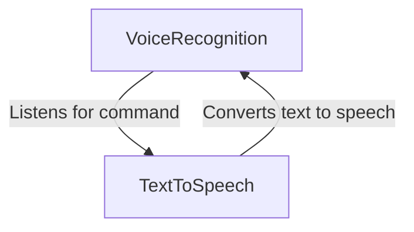

## CommandProcessor

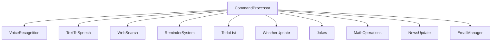

## WebSearch

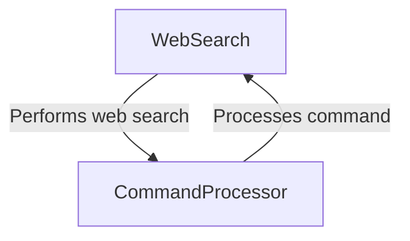

## ReminderSystem

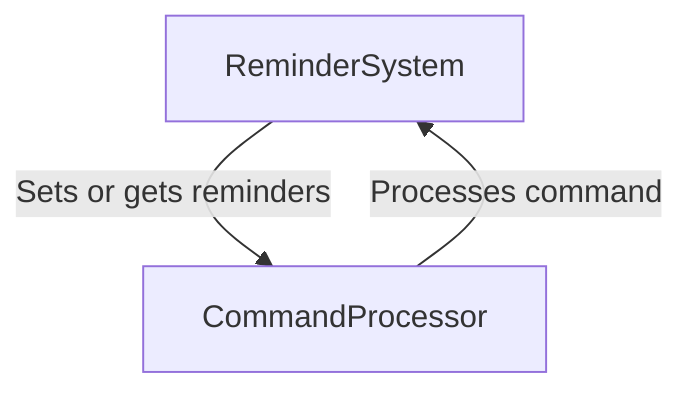

## TodoList

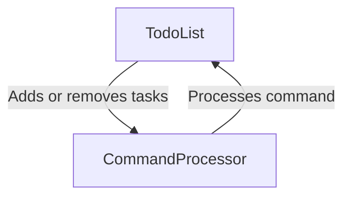

## WeatherUpdate

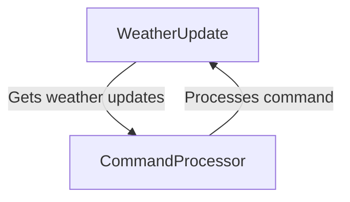

## Jokes

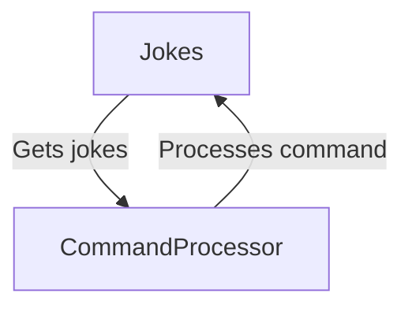

## MathOperations

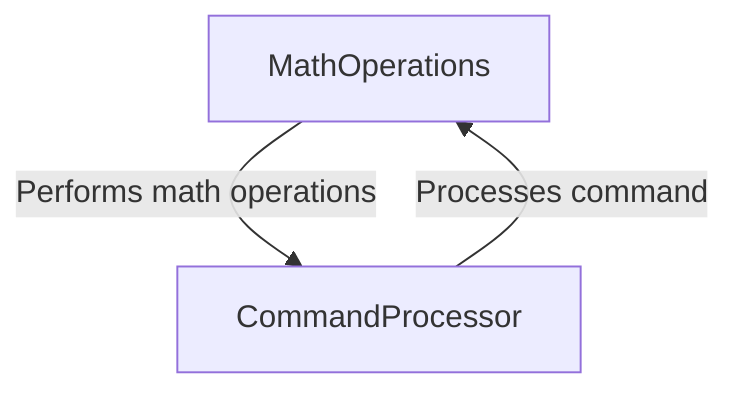

## NewsUpdate

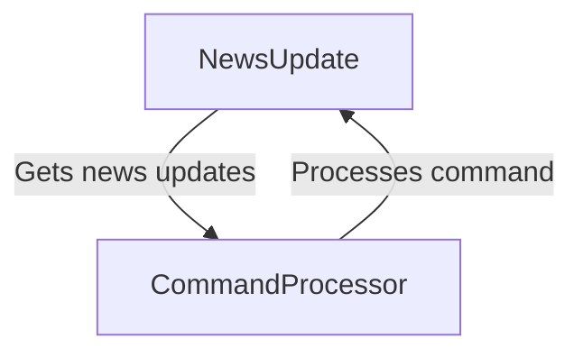

## EmailManager

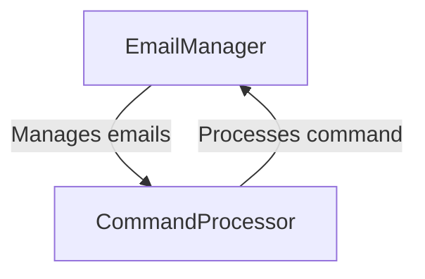

## Main

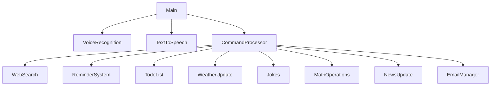
