# Flowcharts

## VoiceRecognition & TTS

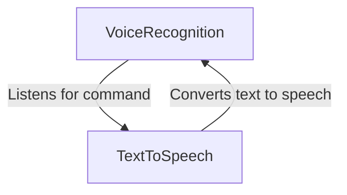

## CommandProcessor

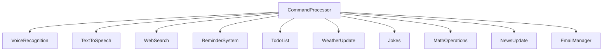

## WebSearch

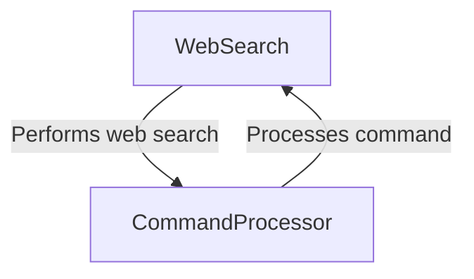

## ReminderSystem

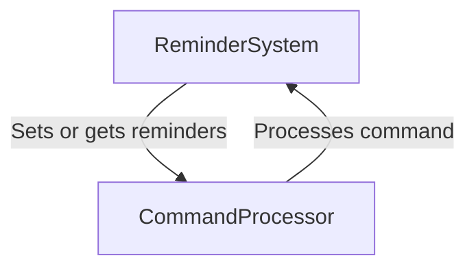

## TodoList

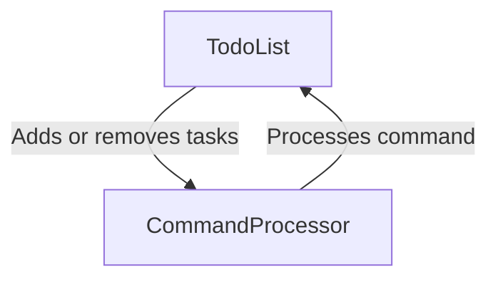

## WeatherUpdate

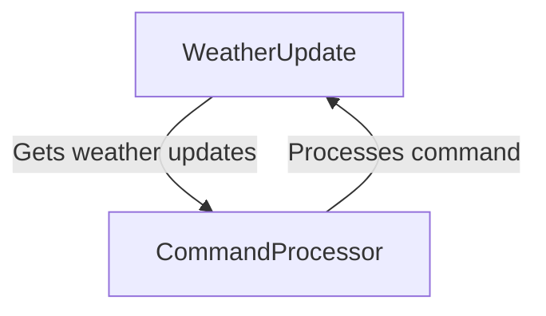

## Jokes

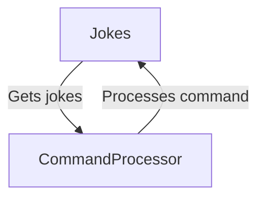

## MathOperations

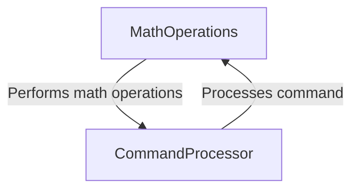

## NewsUpdate

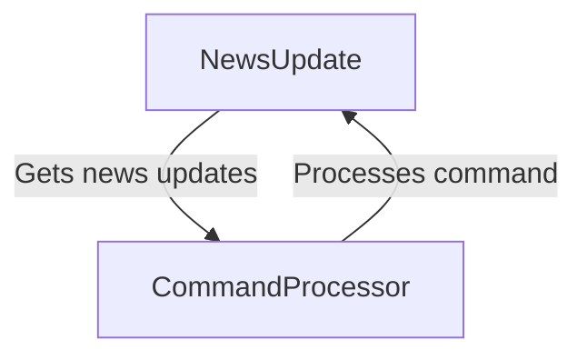

## EmailManager

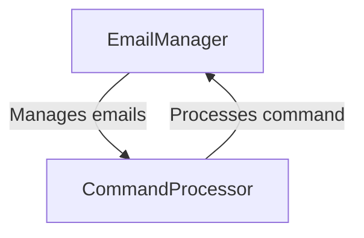

## Main

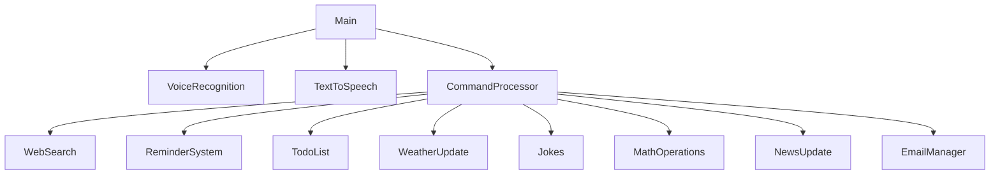
