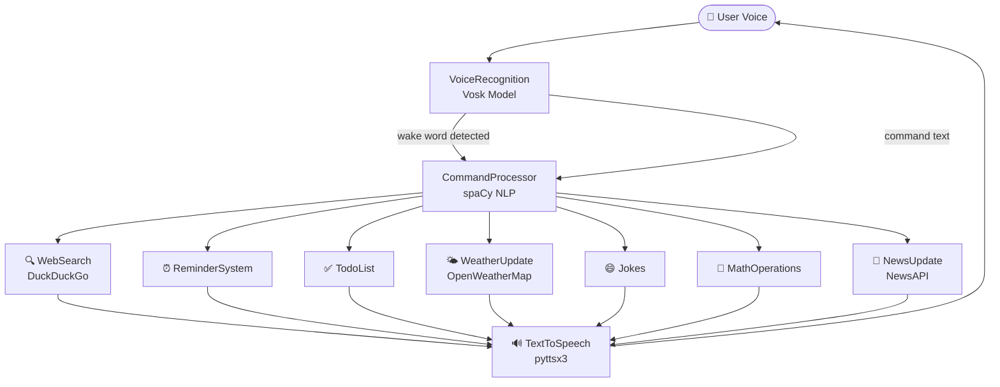

<div align="center">

```
 _   _                  _            _     _              _
| | | | ___ _   _      / \   ___ ___(_)___| |_ __ _ _ __ | |_
| |_| |/ _ \ | | |    / _ \ / __/ __| / __| __/ _` | '_ \| __|
|  _  |  __/ |_| |   / ___ \\__ \__ \ \__ \ || (_| | | | | |_
|_| |_|\___|\__, |  /_/   \_\___/___/_|___/\__\__,_|_| |_|\__|
            |___/
```

**An offline, privacy-first voice assistant built in Python.**

[](https://www.python.org/)
[](LICENSE)
[](https://github.com/arozx/virtual_assitant/commits)
[](https://github.com/arozx/virtual_assitant/stargazers)
[](https://github.com/arozx/virtual_assitant/actions/workflows/lint.yml)

> 🎙️ Say **"Hey Assistant"** — and let it handle the rest.  
> No cloud. No tracking. Just your voice and your machine.

</div>

---

## ✨ What can it do?

| Say this… | It does this… |
|---|---|
| *"Hey Assistant, search Python tutorials"* | Reads top DuckDuckGo results aloud |
| *"Hey Assistant, what's the weather in London"* | Speaks current conditions via OpenWeatherMap |
| *"Hey Assistant, tell me a joke"* | Delivers setup + punchline |
| *"Hey Assistant, add buy milk to my todo"* | Adds task to a persistent to-do list |
| *"Hey Assistant, remind me at 5pm"* | Sets a spoken reminder |
| *"Hey Assistant, what's in the news today"* | Reads top headlines |
| *"Hey Assistant, calculate 42 times 7"* | Evaluates math expressions *(coming soon)* |

---

## 🚀 Why this project?

- 🔒 **Fully offline voice recognition** — powered by [Vosk](https://alphacephei.com/vosk/), your voice never leaves your machine
- 🦆 **DuckDuckGo search** — no Google, no tracking, no API key required
- 🧩 **Modular plugin architecture** — add new commands by dropping in a new module
- 🗺️ **NLP-powered location extraction** — uses [spaCy](https://spacy.io/) + GeoNames to understand place names for weather queries
- 🗣️ **Text-to-speech output** — responses are spoken back using pyttsx3 (local, no cloud TTS)

---

## 🏠 Use Cases

| Scenario | How it helps |
|---|---|
| 🏠 **Smart home companion** | Run on a Raspberry Pi for always-on, hands-free control |
| 🧑‍💻 **Developer assistant** | Look up docs, check the news, set focus timers — without leaving the terminal |
| ♿ **Accessibility tool** | Voice-driven to-do and reminder management for hands-free workflows |
| 🎓 **Learning project** | Clean, modular Python codebase — great for learning NLP, audio processing, and API integration |

---

## ⚡ Quick Start (60 seconds)

```bash
# 1. Clone the repository
git clone https://github.com/arozx/virtual_assitant.git
cd virtual_assitant

# 2. Install Python dependencies
pip install -r requirements.txt
python -m spacy download en_core_web_sm

# 3. Download a Vosk speech model (small English model ~50 MB)
wget https://alphacephei.com/vosk/models/vosk-model-en-us-0.42-gigaspeech.zip
unzip vosk-model-en-us-0.42-gigaspeech.zip

# 4. Set up environment variables
cp example.env .env
# Edit .env and add your API keys (see example.env for details)

# 5. Download GeoNames data and extract locations
wget https://download.geonames.org/export/dump/cities500.zip
unzip cities500.zip
python extract.py cities500.txt

# 6. Run the assistant
python main.py
```

Then say **"Hey Assistant"** followed by your command!

---

## 📦 Installation

### Prerequisites

- Python 3.10+
- A microphone connected to your system
- API keys for [OpenWeatherMap](https://openweathermap.org/api) and [NewsAPI](https://newsapi.org/) *(free tiers available)*

### Environment Variables

Copy `example.env` to `.env` and fill in your keys:

```env
WEATHER_API_KEY=your_openweathermap_api_key_here
NEWS_API_KEY=your_newsapi_key_here
```

---

## 🏗️ Architecture


```mermaid
flowchart TD
    User([🎤 User Voice]) --> VR[VoiceRecognition\nVosk Model]
    VR --> |wake word detected| CP[CommandProcessor\nspaCy NLP]
    VR --> |command text| CP

    CP --> WS[🔍 WebSearch\nDuckDuckGo]
    CP --> RS[⏰ ReminderSystem]
    CP --> TL[✅ TodoList]
    CP --> WU[🌤️ WeatherUpdate\nOpenWeatherMap]
    CP --> JK[😄 Jokes]
    CP --> MO[🔢 MathOperations]
    CP --> NU[📰 NewsUpdate\nNewsAPI]

    WS & RS & TL & WU & JK & MO & NU --> TTS[🔊 TextToSpeech\npyttsx3]
    TTS --> User
```

---

## 🧩 Build Your Own Plugin

Adding a new command module is straightforward. Here's the pattern every plugin follows:

**1. Create your module** (e.g. `myfeature/myfeature.py`):

```python
class MyFeature:
    def do_something(self, command: str) -> str:
        # parse the command and return a response string
        return "Here is your result!"
```

**2. Add an `__init__.py`** that exports your class:

```python
from .myfeature import MyFeature
```

**3. Wire it into `main.py`**:

```python
from myfeature import MyFeature
my_feature = MyFeature()
cp = CommandProcessor(..., my_feature=my_feature)
```

**4. Handle the command in `commands/command_processor.py`**:

```python
elif "trigger word" in command:
    result = self.my_feature.do_something(command)
    self.read(result)
```

See [CONTRIBUTING.md](CONTRIBUTING.md) for the full plugin guide and contribution workflow.

---

## 📁 Project Structure

```
virtual_assitant/
├── main.py                  # Entry point — wires all modules together
├── voice_recognition.py     # Wake word detection + speech-to-text (Vosk)
├── tts.py                   # Text-to-speech output (pyttsx3)
├── extract.py               # GeoNames data extractor
├── commands/
│   └── command_processor.py # Routes spoken commands to the right module
├── web/                     # DuckDuckGo web search
├── weather/                 # OpenWeatherMap weather queries
├── news/                    # NewsAPI headline fetching
├── reminders/               # Reminder scheduling
├── todo/                    # Persistent to-do list
├── jokes/                   # Joke fetching
└── math_operations/         # Math expression evaluation (coming soon)
```

---

## 🤝 Contributing

Contributions are welcome! Whether it's a bug fix, new plugin, or documentation improvement — see [CONTRIBUTING.md](CONTRIBUTING.md) to get started.

---

## 📄 License

This project is licensed under the [MIT License](LICENSE).

---

<div align="center">

Made with ❤️ in Python · [Report a Bug](https://github.com/arozx/virtual_assitant/issues) · [Request a Feature](https://github.com/arozx/virtual_assitant/issues)

</div>
